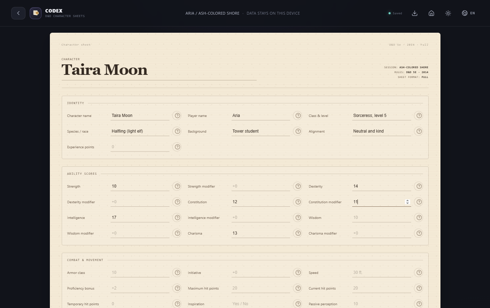
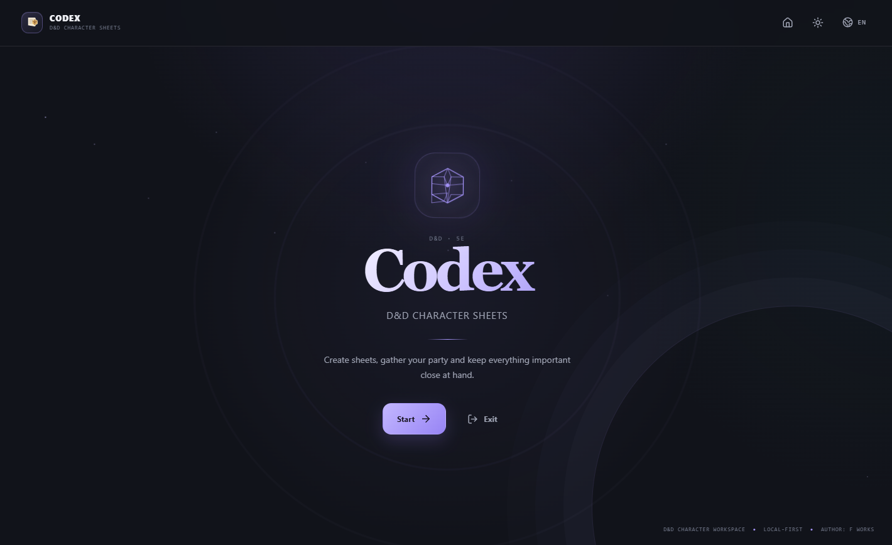
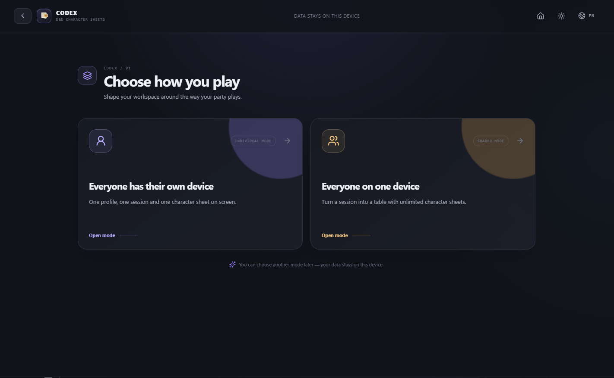
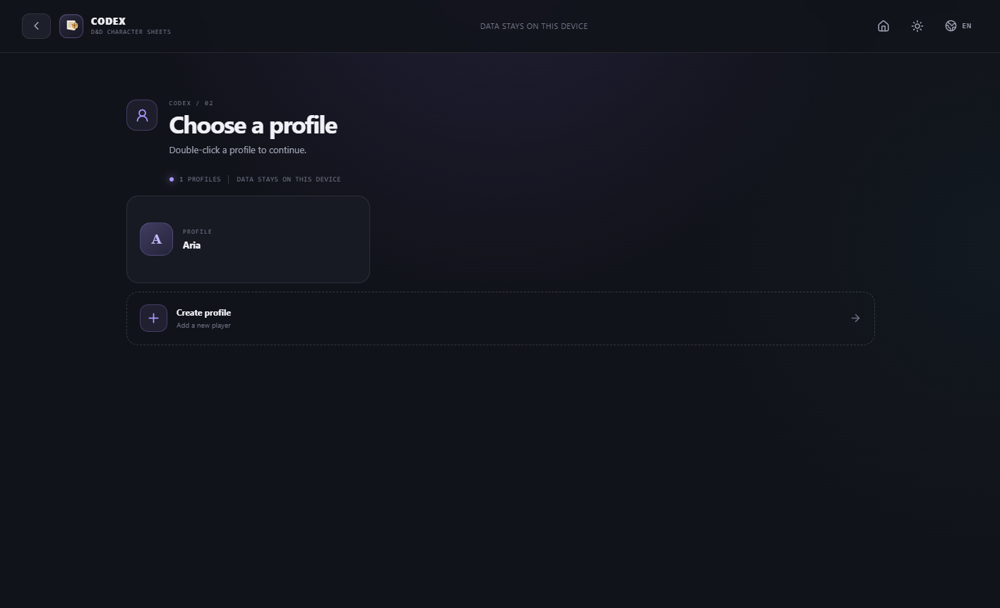
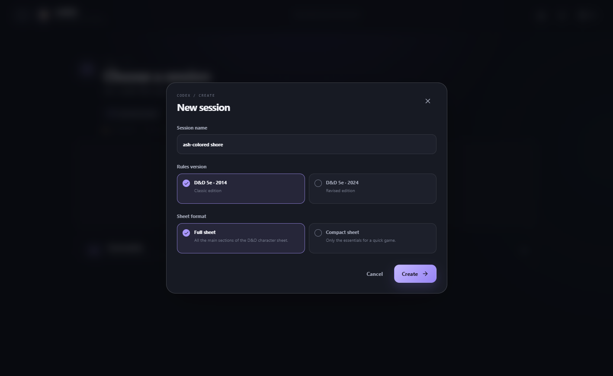
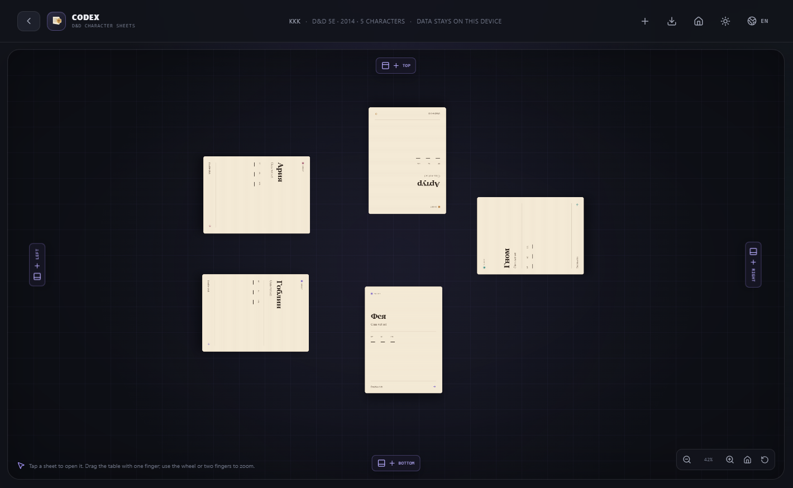

[Русский](README.md)

# Codex — D&D Character Sheets

A local application for keeping visual Dungeons & Dragons 5e character sheets.
Current version: `1.0.0`. Supported on Windows, Linux and Android.

## Features

- two working modes: individual sheets and a shared table holding several sheets;
- profiles and sessions with local storage;
- D&D 5e rulesets for 2014 and 2024;
- full and compact sheet templates;
- built-in `?` help next to every field;
- dark and light themes;
- Russian and English interface;
- automatic saving to local storage;
- sheet export to PDF: system print dialog on desktop, Share/PDF on Android;
- table with panning, zooming, draggable sheets and edge buttons for adding sheets;
- touch controls for the table: drag, pinch-zoom, tap to open a sheet;
- hideable table toolbar on Android with landscape orientation locked for the table;
- localized standard Electron menu;
- installer with language, folder and shortcut selection plus a review screen.

## How to download

Ready-made files are in the **[Releases](../../releases)** section. Download the one for your platform and run it.

| Platform | File | Size |
|---|---|---|
| Windows | `DND-Character-Sheets-Setup-1.0.0.exe` | 128 MB |
| Android | `DND-Character-Sheets-1.0.0.apk` | 3.5 MB |
| Android | `DND-Character-Sheets-1.0.0.aab` | 3.4 MB |

**Windows.** Download the `.exe` and run it. The installer asks for language, folder and shortcuts, then shows a review screen.

**Android.** Download the `.apk`, allow installing from this source in your Android settings, and open the file. The app is signed with a permanent key, so every future version updates the already installed app.

**Linux.** The build is wired to GitHub Actions: the workflow `.github/workflows/release-linux.yml` builds `.AppImage` and `.deb` when a `v*` tag appears and attaches them to the release. Until it has run for the first time there are no finished Linux files. Locally on Windows only the unpacked `linux-unpacked` folder can be built — that is a directory, not a single file, and it has to be copied to Linux as a whole.

## Screenshots

| | |
|---|---|
|  |  |
| **Start screen** — no account needed | **Mode selection** — personal sheets or a shared table |
|  |  |
| **Profiles** — own or shared | **New session** — per game and per ruleset |
|  |  |
| **Shared table** — sheets are draggable, the table pans and zooms | **Character sheet** — `?` help on every field |

## License

Apache-2.0. Full text is in [LICENSE](LICENSE). The code may be modified and used in your own projects provided you keep the copyright notice.

## Privacy

The app works locally: sheet, profile and session data is stored in the app profile and is never sent anywhere. System backup is disabled in the AndroidManifest, the WebView permission is only used by the internal Capacitor runtime, and the app performs no network requests.

One limitation: in the "everyone on one device" mode separate devices do not sync with each other — this is a local-first app with no server.