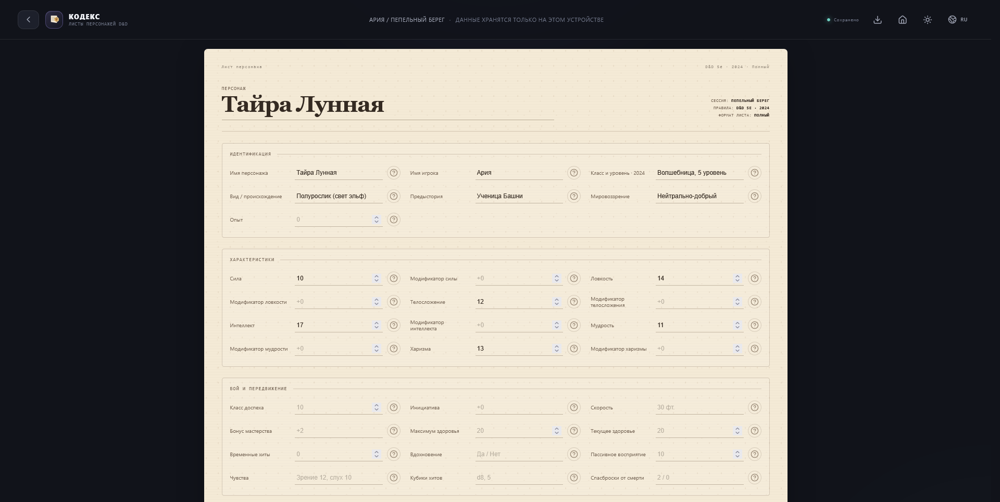
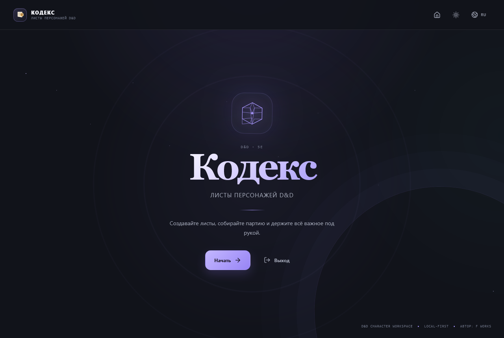
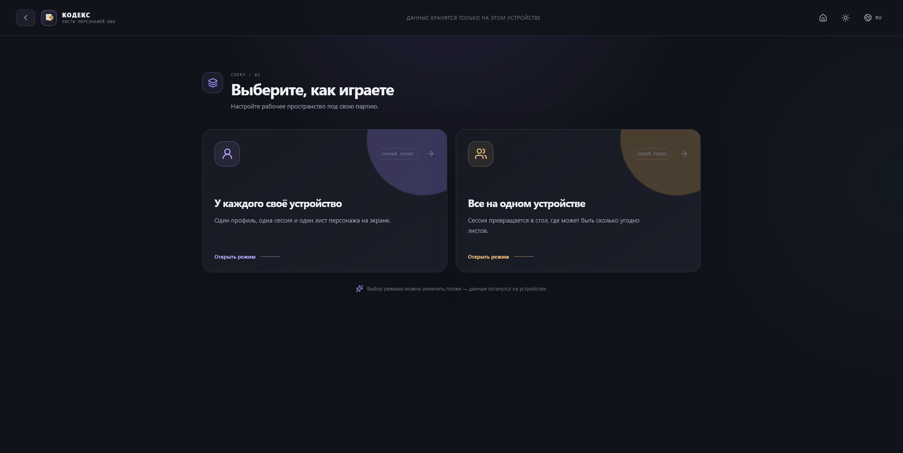
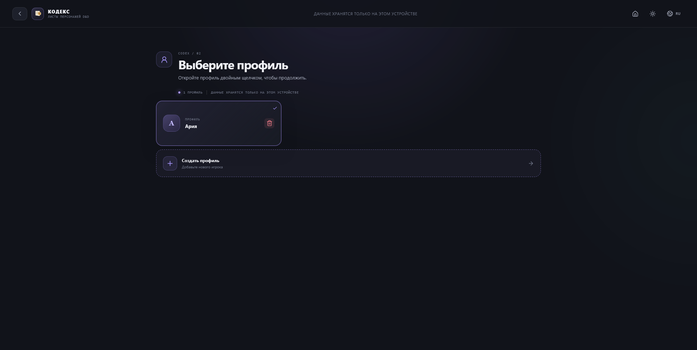
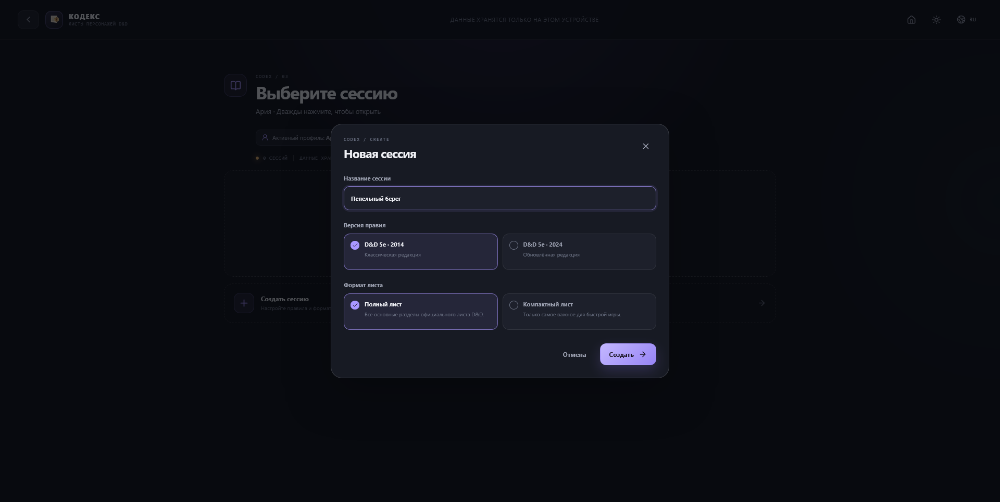
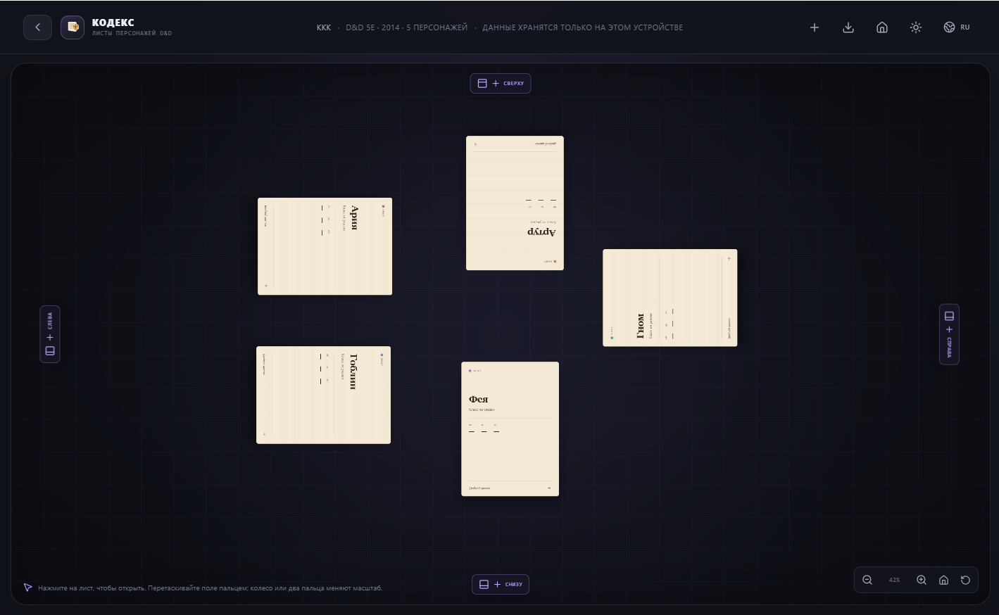

[English](README.en.md)

# Кодекс — листы персонажей D&D

Локальное приложение для ведения визуальных листов персонажей Dungeons & Dragons 5e.
Текущая версия: `1.0.0`. Поддерживаются Windows, Linux и Android.

## Возможности

- два режима работы: индивидуальные листы и общий стол с несколькими листами;
- профили и сессии с локальным хранением;
- редакции правил D&D 5e 2014 и 2024;
- полный и компактный шаблоны листа;
- встроенная помощь `?` у каждого параметра;
- тёмная и светлая темы;
- русский и английский интерфейс;
- автоматическое сохранение в локальное хранилище;
- экспорт открытого листа в PDF: системное окно печати на ПК, Share/PDF на Android;
- стол с панорамированием, масштабированием, перетаскиванием листов и добавлением по краям;
- сенсорное управление столом: перетаскивание, pinch-zoom, открытие листа касанием;
- скрываемая панель стола на Android с фиксацией альбомной ориентации;
- локализованное стандартное меню Electron;
- установщик с выбором языка, папки, ярлыков и экраном проверки параметров.

## Как скачать

Готовые файлы лежат в разделе **[Releases](../../releases)**. Скачайте нужный под свою платформу и запустите.

| Платформа | Файл | Размер |
|---|---|---|
| Windows | `DND-Character-Sheets-Setup-1.0.0.exe` | 128 МБ |
| Android | `DND-Character-Sheets-1.0.0.apk` | 3,5 МБ |
| Android | `DND-Character-Sheets-1.0.0.aab` | 3,4 МБ |

**Windows.** Скачайте `.exe` и запустите. Установщик спросит язык, папку и ярлыки, после чего покажет экран проверки.

**Android.** Скачайте `.apk`, разрешите установку из этого источника в настройках Android и откройте файл. Приложение подписано постоянным ключом, поэтому все будущие версии обновляют уже установленное приложение.

**Linux.** Сборка подключена к GitHub Actions: workflow `.github/workflows/release-linux.yml` при появлении тега `v*` собирает `.AppImage` и `.deb` и прикрепляет их к релизу. До его первого запуска готовых Linux-файлов нет. Локально на Windows собирается только распакованная папка `linux-unpacked` — это каталог, а не единый файл, и переносить его на Linux нужно целиком.

## Скриншоты

| | |
|---|---|
|  |  |
| **Первый экран** — вход без аккаунта | **Выбор режима** — личный стол или общий стол |
|  |  |
| **Профили** — свои или общие | **Создание сессии** — под игру и под редакцию правил |
|  |  |
| **Общий стол** — листы перетаскиваются, стол панорамируется и масштабируется | **Лист персонажа** — помощь `?` у каждого поля |

## Лицензия

Apache-2.0. Полный текст — в файле [LICENSE](LICENSE). Код можно изменять и использовать в своих проектах при сохранении уведомления об авторстве.

## Приватность

Приложение работает локально: данные листов, профилей и сессий хранятся в профиле приложения и никуда не отправляются. В AndroidManifest отключён системный backup, а WebView-разрешение используется только внутренним runtime Capacitor; сетевых запросов приложение не выполняет.

Ограничение по синхронизации: в режиме «У каждого своё устройство» отдельные устройства между собой не синхронизируются — это локально-первое приложение без сервера.